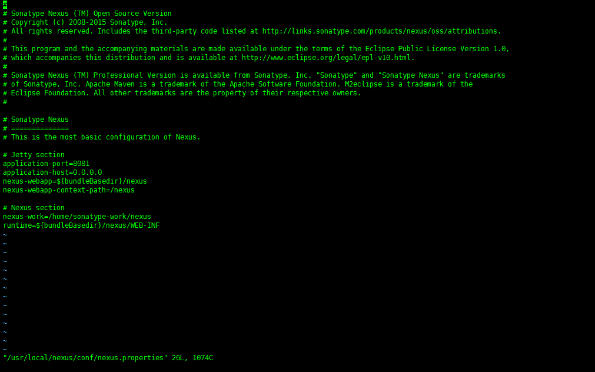
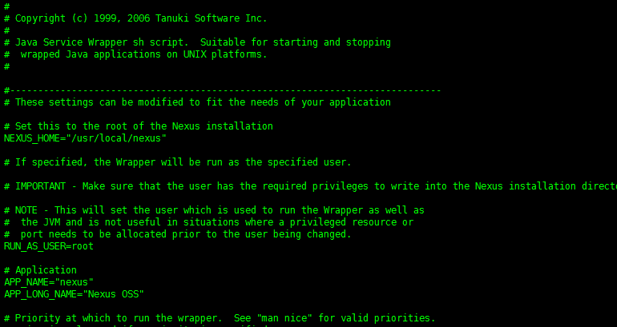
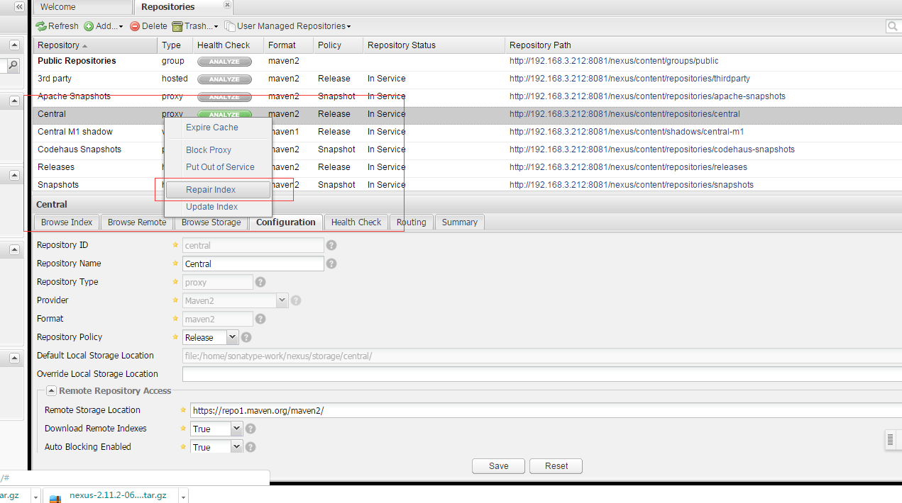
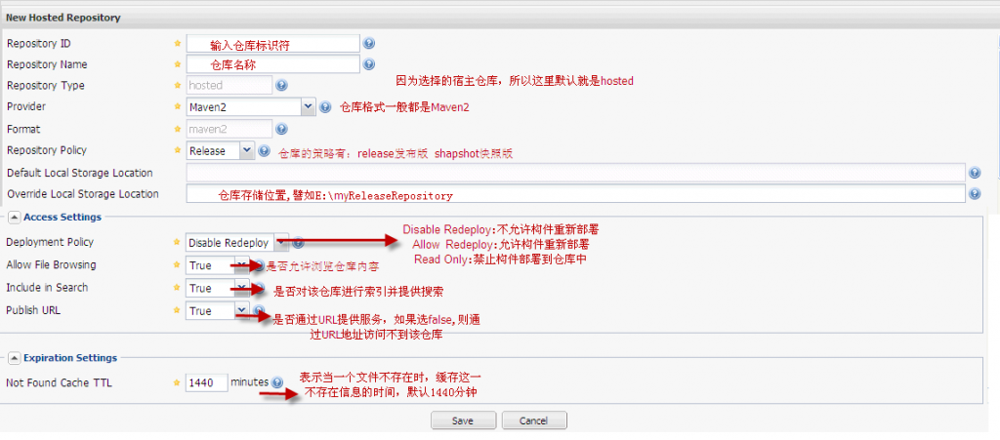
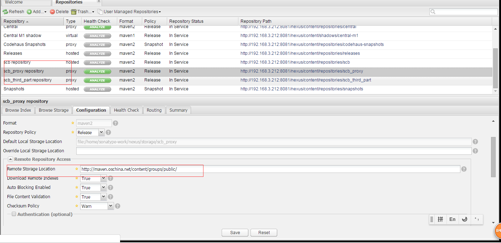
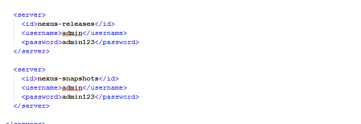
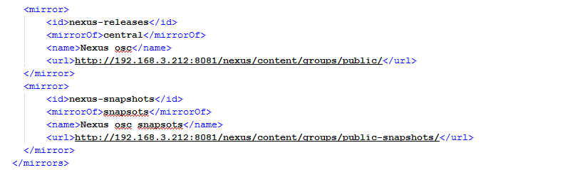
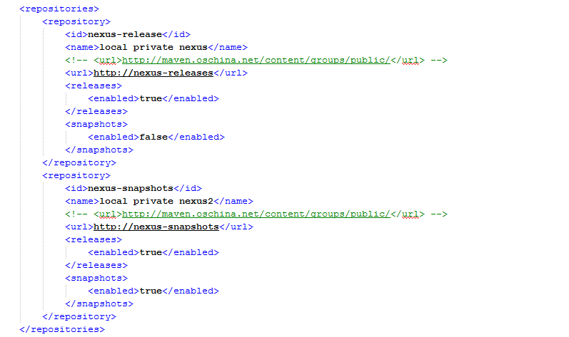
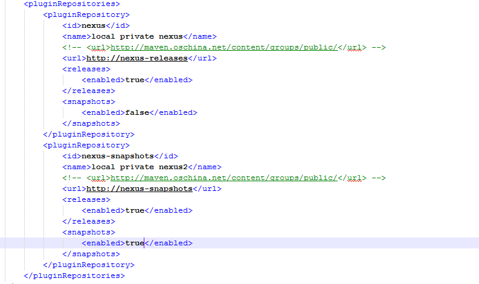
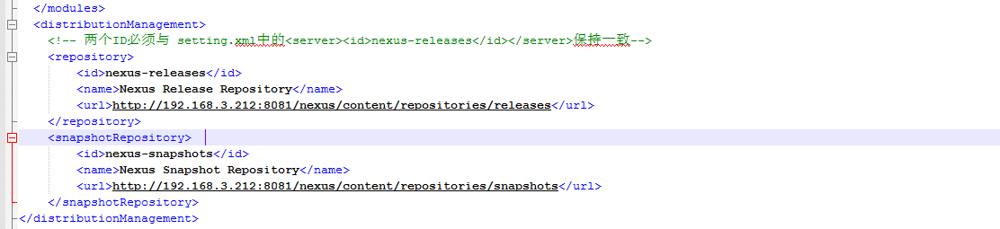

## Nexus

使用**Maven**构建项目的应该都听说过**nexus**，他能帮你构建一个本地maven仓库，毕竟中央仓库有时可能会连不上；再者，更重要的是他可以帮你以maven的形式管理自己的项目。

下面是简单的在Centos上的安装过程：

### 1. 安装准备

安装最新版本就行

> \# **yum install java**  

### 2. 下载Nexus

**nexus** 不能**yum** 安装，因此我们只能下载包进行手动安装。

访问官方网站，进入nexus的下载页面[http://www.sonatype.org/nexus/go](http://www.sonatype.org/nexus/go "http://www.sonatype.org/nexus/go")，然后选择**“TGZ”**格式的安装包进行下载。

### 3. 安装Nexus

1. 解压文件，移动文件夹

	> \# **tar xvzf nexus-2.11.2.-06-bundle.tar.gz**

	> \# **mv nexus-2.11.2-06 /usr/local/nexus-2.11.2-06**

	> \# **cd /usr/local/**

	> \# **ln -s nexus-2.11.2-06 nexus**

2. 修改nexus.conf配置文件

	> \#**vi /usr/local/nexus/conf/nexus.properties**

	可以修改端口等信息。

	

3. 设置**nexus**为系统服务并开机自启动

	- 复制$NEXUS_HOME/bin/jsw/linux-x86-64/nexus 到/etc/init.d/nexus

		> \# **cd /etc/init.d/**

		> \# **cp /usr/local/nexus/bin/jsw/linux-x86-64/nexus nexus**

	- 编辑/etc/init.d/nexus文件：
	
		a)修改*NEXUS_HOME*为绝对路径；

		b)设置*RUN_AS_USER=root*，即运行nexus的用户

		

		c) > \# **chkconfig --add nexus**

		d) > \# **chkconfig --levels 345 nexus on**

4. 启动**Nexus**

> \# **systemctl start nexus**

5. 防火墙设置

> \# **firewall-cmd --zone=public --add-port=8081/tcp --permanent**

> \# **firewall-cmd --reload**

### 4. Neuxs配置

1. **开启远程索引**

	新搭建的neuxs环境只是一个空的仓库，需要手动和远程中心库进行同步，nexus默认是关闭远程索引下载，最重要的一件事情就是开启远程索引下载。登陆nexus系统，默认用户名密码为admin/admin123。

	点击左边Administration菜单下面的Repositories，找到右边仓库列表中的三个仓库Apache Snapshots，Codehaus Snapshots和Maven Central，然后再没有仓库的configuration下把Download Remote Indexes修改为true。

	
	
	然后在*Apache Snapshots*，*Codehaus Snapshots*和*Maven Central*这三个仓库上分别右键，选择*Repari Index*，这样Nexus就会去下载远程的索引文件。

	

2. **建立宿主仓库**

	新建公司的内部仓库，步骤为*Repositories* –> *Add* –> *Hosted Repository*，在页面的下半部分输入框中填入*Repository ID*和*Repository Name*即可，另外把*Deployment Policy*设置为*Allow Redeploy*，点击save就创建完成了。这里我点击添加宿主类型的仓库，在仓库列表的下方会出现新增仓库的配置，如下所示：

	

3. **创建Nexus代理仓库**

	代理仓库的创建与宿主仓库的创建基本一致，步骤为*Repositories* –> *Add* –> *Proxy Repository*，只有一点不同，需多填一个*Remote Storage Location*。创建代理仓库的目的是因为中央仓库在国内并不能很好的访问。依次创建*main proxy repository* 和 *thirdpart proxy repository*，如下图：

	

4. **创建Nexus仓库组**

	Nexus 中仓库组的概念是Maven没有的，在Maven看来，不管你是hosted也好，proxy也好，或者group也好，对我都是一样的，我只管根据 groupId，artifactId，version等信息向你要构件。为了方便Maven的配置，Nexus能够将多个仓库，hosted或者 proxy合并成一个group，这样，Maven只需要依赖于一个group，便能使用所有该group包含的仓库的内容。

	neuxs中默认自带了一个名为“Public Repositories”组，点击该组可以对他保护的仓库进行调整，把刚才建立的公司内部仓库scb repostiory等加入其中，这样就不需要再在maven中明确指定内部仓库 的地址了。同时创建一个Group ID为public-snapshots、Group Name为Public Snapshots Repositories的组，把Apache Snapshots、Codehaus Snapshots、Snapshots和zfy repostiory等加入其中。

5. **maven中设置**

	使用时，在maven的配置文件*settiong.xml*中做如下修改：

	

	

	

	

6. **在项目的POM.xml中配置**

	

### Maven 安装

> \# **wget http://repos.fedorapeople.org/repos/dchen/apache-maven/epel-apache-maven.repo -O /etc/yum.repos.d/epel-apache-maven.repo**

> \# **yum install apache-maven**

