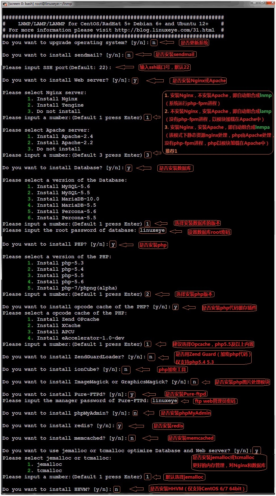
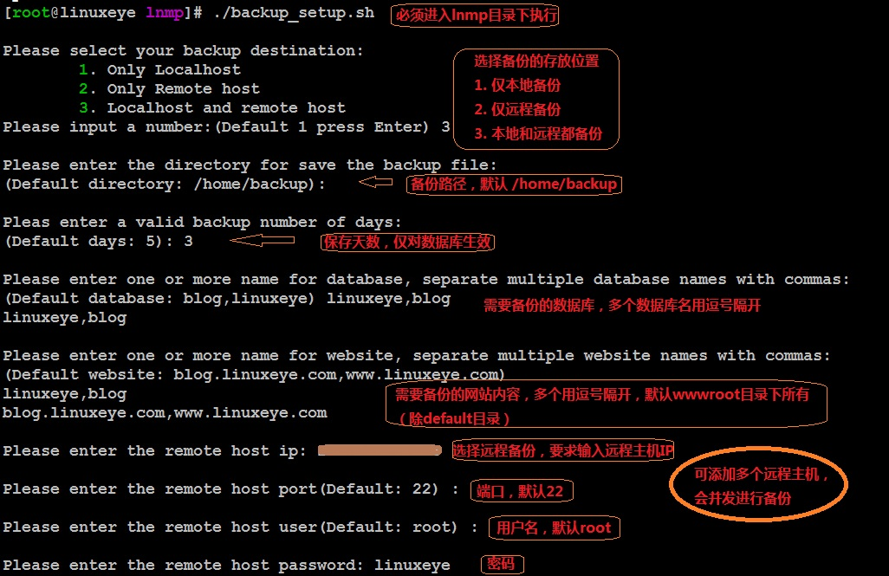
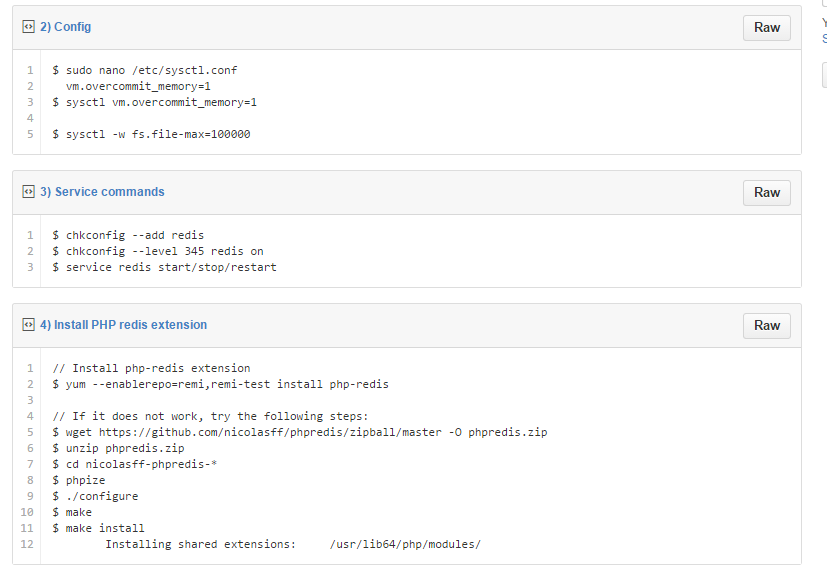
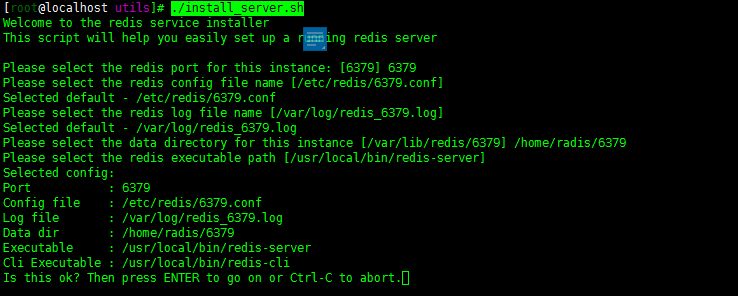
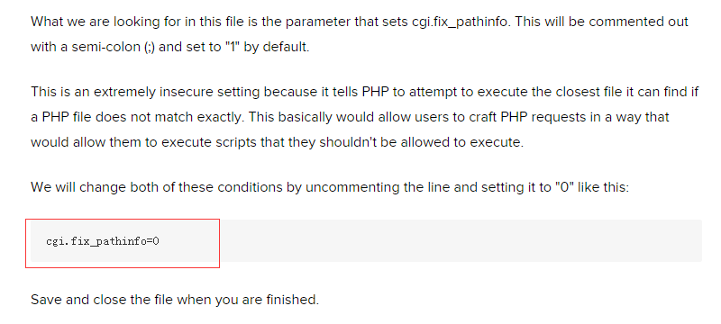
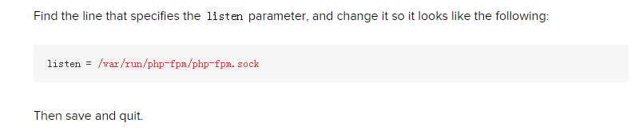

## CENTOS7 安装LNMP 

### 使用脚本安装

	脚本地址：https://github.com/lj2007331/lnmp

步骤：

1. **yum -y install wget screen # for CentOS/Redhat**

2. **wget http://mirrors.linuxeye.com/lnmp.tar.gz**

3. **tar xzf lnmp.tar.gz**

4. **cd lnmp**

5. **screen -S lnmp**

6. **./install.sh**

### 数据备份

> \# **cd ~/lnmp # 必须进入lnmp目录下执行**

> \# **./backup_setup.sh # 备份参数设置**

> \# **./backup.sh # 立即执行备份**

> \# **crontab -e # 可添加到计划任务，如每天凌晨1点自动备份**

> \# **0 1 * * * cd ~/lnmp;./backup.sh  > /dev/null 2>&1 &**

### 管理服务

1. Nginx:

	> \# systemctl (start|stop|restart|status) nginx

2. MariaDB:

	> \# systemctl (start|stop|restart|status) mariaDB

3. PHP:

	> \# systemctl (start|stop|restart|status) php|php-fpm

4. Pure-Ftpd:

	> \# systemctl (start|stop|restart|status) pureftpd

5. Redis:

	> \# systemctl (start|stop|restart|status) redis-server

6. memcached:

	> \# systemctl (start|stop|restart|status) memcached

### 版本升级

> \# **cd ~/lnmp # 必须进入lnmp目录下执行**

> \# **./upgrade_php.sh #升级PHP**

> \# **./upgrade_web.sh #升级Nginx/Tengine**

> \# **./upgrade_redis.sh #升级Redis**

> \# **./upgrade_phpmyadmin.sh #升级phpMyAdmin **

### 卸载LNMP

> \# **cd ~/lnmp # 必须进入lnmp目录下执行**

> \# **./uninstall.sh**

### 重装LNMP

> \# **cd ~/lnmp # 必须进入lnmp目录下执行**

> \# **./uninstall.sh  #备份数据；卸载**

> \# **./install.sh    #再次安装**

### 单独安装

1. **Radis**

	> \# **wget http://download.redis.io/releases/redis-3.0.1.tar.gz**

	> \# **tar xzvf redis-3.0.1.tar.gz**

	> \# **cd redis-3.0.1**

	> \# **make**

	> \# **make install**

	

	> \# **cd utils**

	> \# **./install_server.sh**

	

	开启端口:

	> \# **firewall-cmd --zone=public --add-port=6379/tcp --permanent**

	> \# **firewall-cmd --reload**

	> \# **semanage port -a -t ssh_ port _t -p tcp 6379**

2. **Nginx**

	> \# **rpm -Uvh http://nginx.org/packages/centos/7/noarch/RPMS/nginx-release-centos-7-0.el7.ngx.noarch.rpm**

	> \# **yum install nginx**

	> \# **systemctl start nginx.service**

	> \# **systemctl enable nginx**

3. **Memcached**

	> \# **yum install memcached**

	> \# **systemctl start memcached**

	> \# **systemctl enable memcached**

	开启端口:

	> \# **firewall-cmd --zone=public --add-port=11211/tcp --permanent**

	> \# **firewall-cmd --reload**

	> \# **semanage port -a -t ssh_ port _t -p tcp 11211**

4. **MariaDB**

	在 /etc/yum.repos.d 下添加一文件：MariaDB.repo，内容如下：
	
		[mariadb]

		name = MariaDB

		baseurl = http://yum.mariadb.org/10.0/centos6-amd64

		gpgkey=https://yum.mariadb.org/RPM-GPG-KEY-MariaDB

		gpgcheck=1

	> \# **yum clean all**

	> \# **yum install mariadb-server mariadb**

	> \# **systemctl start mariadb**

	> \# **mysql_secure_installation**

	

	> \# **systemctl enable mariadb**

	登入MariaDB，创建远程登入用户，为方便测试，给予最高权限：
	> \# **mysql -u root -p**

	> \# **'yourpassword'**

	> \# **use mysql**;

	> \# **grant all privileges on *.* to 'myuser'@'%' identified by 'mypassword' with grant option;**

	> \# **flush privileges;**

5. **PHP**

	> \# **yum install php php-mysql php-fpm**

	> \# **vi /etc/php.ini**

	

	> \# **vi /etc/php-fpm.d/www.conf**

	

	> \# **systemctl start php-fpm**

	> \# **systemctl enable php-fpm**
	
6. **vsFtpd**

	> \# **yum -y install vsftpd**

	编辑 *vsftpd* 的配置文件

	> \# **vi /etc/vsftpd/vsftpd.conf**

	Disallow anonymous, unidentified users to access files via FTP; change the ***anonymous_enable*** setting to ***NO*** :

	> \# **anonymous_enable=NO**

	Allow local uses to login by changing the ***local_enable*** setting to ***YES***:

	> \# **local_enable=YES**

	If you want local user to be able to write to a directory, then change the ***write_enable*** setting to ***YES***:

	> \# **write_enable=YES**

	Local users will be ‘chroot jailed’ and they will be denied access to any other part of the server; change the ***chroot_local_user*** setting to ***YES***:

	> \# **chroot_local_user=YES**

	Exit and save the file with the command ***:wq*** .

	重启vsftpd

	> \# **systemctl restart vsftpd**

	>设置自启动项

	> \# **systemctl enale vsftpd**

	> \# **firewall-cmd --zone=public --add-port=21/tcp --permanent**

	> \# **firewall-cmd --reload**

### Oracle JDK 安装
1. 下载oracle jdk
	
	由于oracle的限制，我们不能直接在centos上使用 **"yum install"**  安装.

	> \# wget --no-cookies --no-check-certificate --header "Cookie: gpw_e24=http%3A%2F%2Fwww.oracle.com%2F; oraclelicense=accept-securebackup-cookie" "http://download.oracle.com/otn-pub/java/jdk/8u45-b14/jdk-8u45-linux-x64.rpm"

2. 安装jdk

	> \# **rpm -Uvh rpm -Uvh jdk-8u45-linux-x64.rpm**