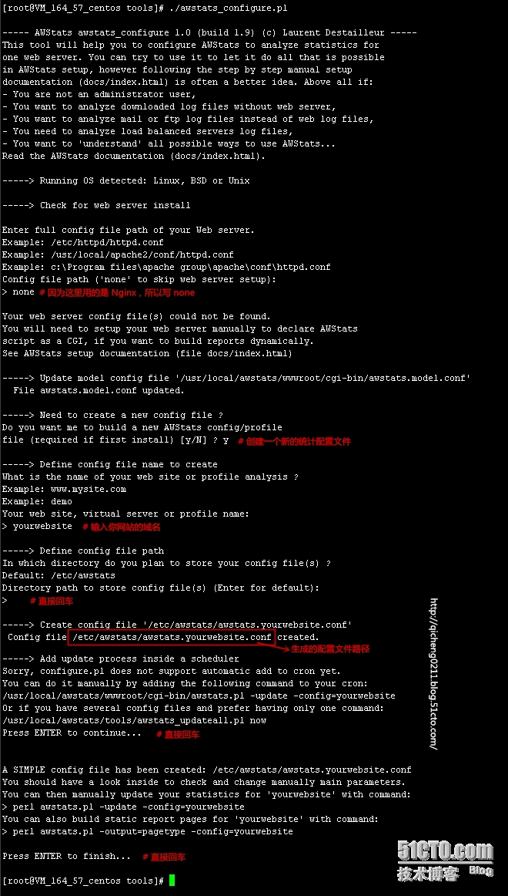
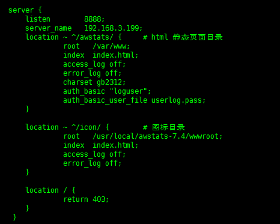

## 日志分析

通过nginx的日志文件来分析网站的访问量等数据。使用Awstats软件来分析相关日志。

### nginx相关配置

1. 修改nginx的日志文件格式，使之符合Awstats的要求：

	> \#    log_format access '$remote_addr - $remote_user [$time_local] "$request" '
        
	> \#    '$status $body_bytes_sent "$http_referer" '
        
	> \#    '"$http_user_agent" "$http_x_forwarded_for"';

	> \#    access_log /var/log/nginx/access.log access;

	注意，日志格式里的双引号不能漏了且每个参数之间是一个空格分隔，因为只要有细微的差别，awstats就无法读取日
	志。

	改好后，使nginx重读配置文件：

	> \# nginx -s reload

2. 处理nginx每天的日志文件

	   nginx自己会每天处理日志文件，按日期每天生成一个日志文件的压缩包，需要将其解压然后存放到指定位置，让
	Awstats软件去分析。

	1) 编写一个shell脚本，每天1点执行：

	> \# #!/bin/bash

	> \# #

	> \# # Filename:    nginxLog.sh

	> \# # Author:      ShenChenBo

	> \# # Description: 解压nginx日志

	> \# # Notes:       设置crontab，每天01点01分定时执行

	> \# ROOT_UID=0

	> \# if [ "$UID" -ne "$ROOT_UID" ];then
    
	> \# echo "Error: 必须以root用户运行此程序！"
    
	> \# exit 1
	
	> \# fi

	> \# nginx_logs_dir="/var/log/nginx"

	> \# nginx_logs_savedir="/var/log/awstats"

	> \# nginx_pid_file="/var/run/nginx.pid"
	
	> \# # 待解压nginx日志文件

	> \# nginx_log_waitting_file="$nginx_logs_dir/access.log-`date -d -1day +%Y%m%d`.gz"

	> \# # 待转移nginx日志文件

	> \# nginx_log_copy_file="$nginx_logs_dir/access.log-`date -d -1day +%Y%m%d`"

	> \# # 复制后的日志文件名，例如access_20141022.log

	> \# nginx_log_today="access_`date -d -1day +%Y%m%d`.log"
 
	> \# [ -f "$nginx_log_today" ] && exit 1

	> \# # 解压

	> \# gunzip $nginx_log_waitting_file

	> \# # 复制到指定路径

	> \# cp $nginx_log_copy_file $nginx_logs_savedir/$nginx_log_today

	> \# # 删除

	> \# # rm -rf $nginx_log_copy_file

	2) 设置定时器

	> \# crontab  -e   # 编辑crontab服务文件
	
	> \# 05 01 * * * /bin/bash /usr/local/nginxLog.sh

### Awstats 相关设置

1. 下载、安装

	> \# wget http://www.awstats.org/files/awstats-7.4.tar.gz

	> \# cd /usr/lcoal

	> \# tar -zxvf awstats-7.4.tar.gz

	> \# mkdir -p /var/lib/awstats

2. 配置Awstats

	> \# cd /usr/local/awstats-7.4/tools/

	> \# ./awstats_configure.pl

	

	> \# 在配置文件中修改读取日志位置：

	> \# LogFile="/var/log/awstats/access_%YYYY-24%MM-24%DD-24.log"

3. 设置定时器

	> \# mkdir -p /var/www/awstats

	> \#  crontab  -e

	> \# > \# 15 01 * * * /usr/local/awstats-7.4/tools/awstats_buildstaticpages.pl -update -config=115.238.49.50 -lang=cn -dir=/var/www/awstats -awstatsprog=/usr/local/awstats-7.4/wwwroot/cgi-bin/awstats.pl

4. 加密设置

	> \# yum -y install httpd-tools

	> \#　htpasswd -cd userlog.pass loguser

5. nginx 配置

	

	