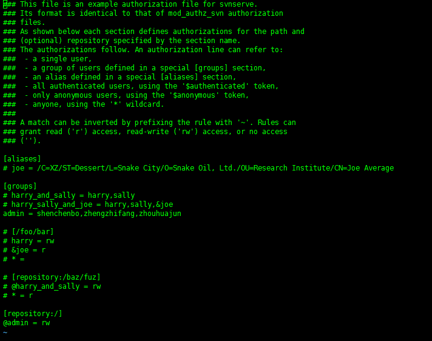

## SVN 安装

SVN作为优秀的代码版本控制器，受到大量用户的使用，需要掌握其在Linux上的安装以及相关配置，包括但不限于权限管理等。

### 安装SVN

> \# **yum install subversion**

### 创建和配置SVN仓库

> \# **mkdir /home/shenchenbo/svn**

> \# **cd /home/shenchenbo/svn**

> \# **svnadmin create repo**

### 创建SVN用户

修改/home/shenchenbo/svn/repo/conf/passwd文件，添加用户信息，例如： "**username=password**":

 

### branches&tags&trunk模式下建svn库

> \# **mkdir -p /tmp/svn-template/{trunk,branches,tags}**

> \# **svn import -m "Initial repository" /tmp/svn-template  file:///home/shenchenbo/svn/repo/**

### 配置用户权限

> \# **vi /home/shenchenbo/svn/repo/conf/athuz**

修改如下：

### svnserve.conf配置

> \# **vi /home/shenchenbo/svn/repo/conf/svnserve.conf** 

### 防火墙设置

> \# **firewall-cmd --zone=public --add-port=3690/tcp --permanent**

> \# **firewall-cmd --reload**

> \# **semanage port -a -t http_port_t -p TCP 3690**

### 启动SVN服务器

> \# **svnserve -d -r /home/shenchenbo/svn/**

### 设置svn为自启动服务

1. 编辑 ***/etc/sysconfig/svnserve*** 文件

	> \# **vi /etc/sysconfig/svnserve**

2. 找到该行：

	> \# **OPTIONS="-r /var/svn"**

3. 修改为：

	> \# **OPTIONS="-r /home/shenchenbo/svn/"** #**后面为你svn仓库的路径，然后保存**

4. 设置自启动：

	> \# **systemctl enable svnserver**

### 后期添加http访问功能以及更强大的权限管理、功能管理