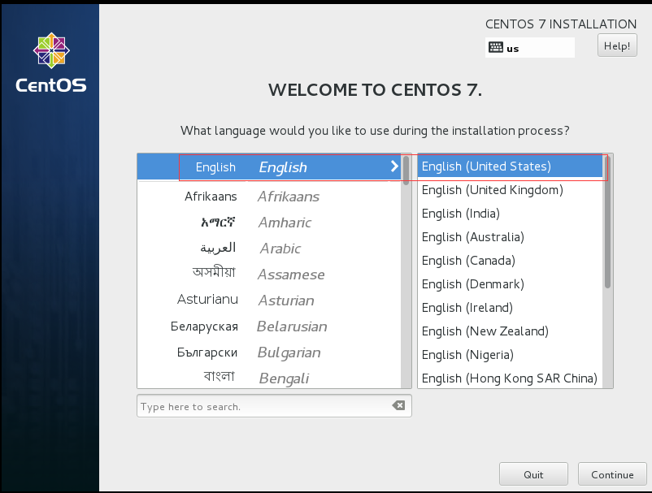
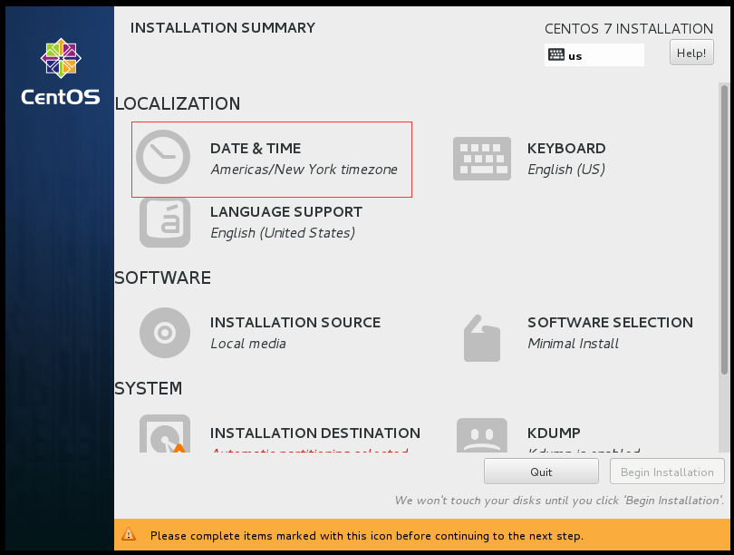
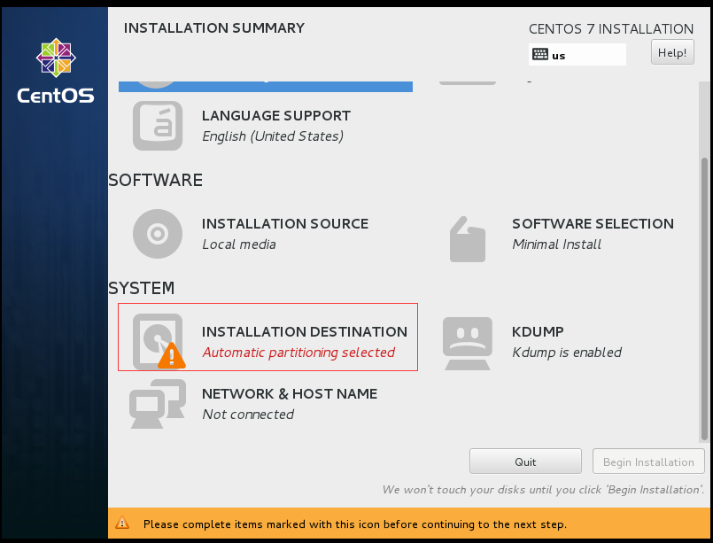
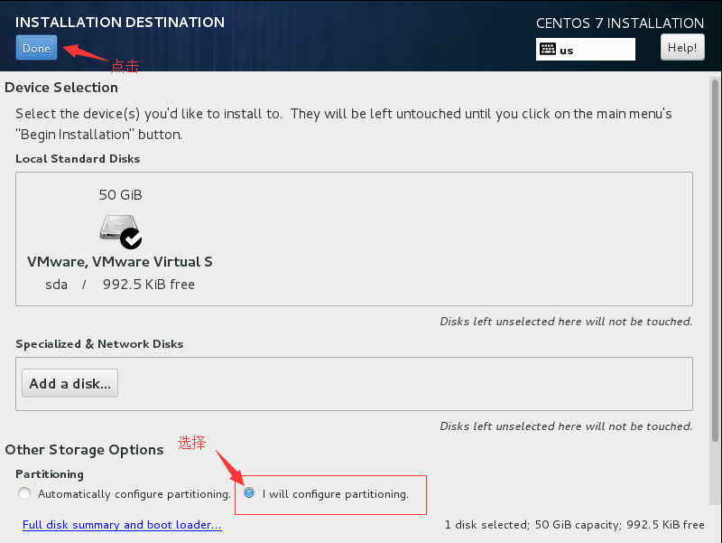
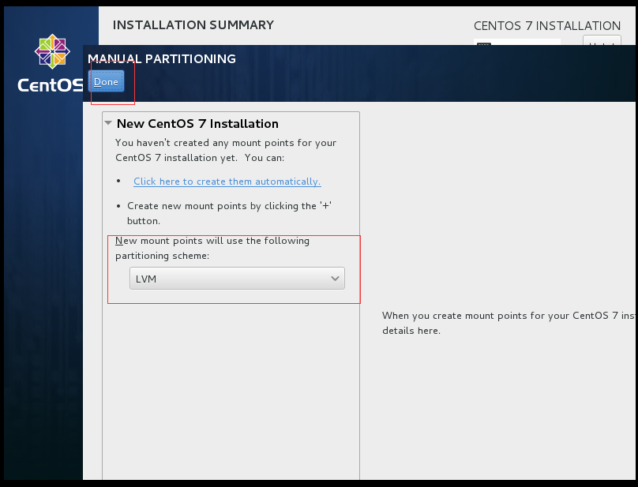
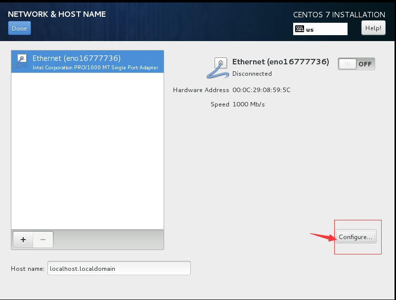
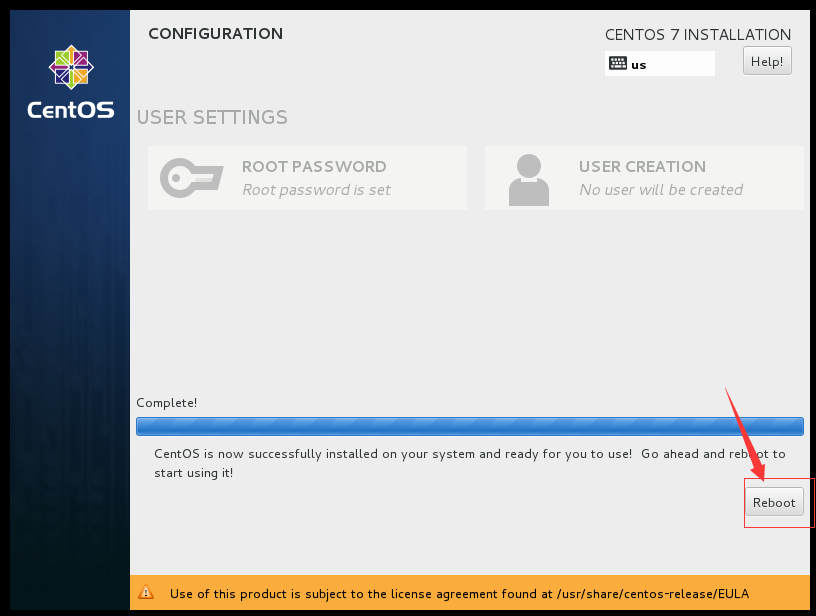

## Linux 安装

	服务器环境一般情况下我们都会选择Linux作为操作系统，这样能更方便的进行管理。

### 准备工作 ###

	这里我们选择Centos 7 作为Linux系统进行安装，并且使用其最小安装镜像进行安装，iso下载地址请[点击这里](http://isoredirect.centos.org/centos/7/isos/x86_64/CentOS-7-x86_64-Minimal-1503-01.iso "Centos 7 下载")。

### 开始安装 ###

1. 选择“Install Centos 7”

     
2. 语言选择“**English**”

     
3. 时区、时间设置

     

     "*点击* **Date&TIme**"

      

     "分别选择 ***'Asia'*** 和 ***'Shanghai'***"

4. 磁盘分区

      

     "点击 ***Installation Destination***"

      

     "在 ***'Other Storage Options'*** 的 ***'Partitioning'*** 中选择 ***'I Will configure parturition'***，然后点击上方的 ***'Done'*** 按钮进入自主分配磁盘页面。"

      

     "选择 ***‘LVM’***，然后点击上方的 ***'Click here to create them automatically'***，进入下一个页面，进行分配。"

      

     我的硬盘是50GB的，大家可以根据自己的情况进行调整，具体分配方案如下：

    	-  System
    	  - /			12.5GB		根目录
    	  - /var		7.5GB		*yum install*的软件会安装在这里
    	  - /BIOS Boot	2048Kib		
    	  - /boot		500MB
    	  - /usr		7.5GB		大量*yum install*的软件会安装在这里
    	  - swap		2048MB		交换分区
  	    -  DATA
  	   	  - /home		20GB		自己存储数据的地方，尽量不要放在*System*分区下。
  	 
     

	 "点击 ***'Accept Changes'***"

5. 网络设置

      

	 "点击选择 ***'NETWORK & HOST NAME'***"

      

	 "点击 ***'Configure'***"

     

	 "在***'IPV4 Settings'***选项卡中配置相关ip信息，由于我是在虚拟机中安装，并且选择了**Bridge**模式，因此和宿主机的网段一样。然后点击***'SAVE'***"。   

      

     "将 ***'ETHERNET'*** 右边的按钮移到***'ON'***，然后就会看到现在网络已经通了，点击*'Done'*"。

6. 开始安装

      
	 
	 "点击 ***'Begin Installation'***开始安装"。

7. 设置root密码

      

	 "点击 ***'Root Password'***，进入root密码设置界面"

	 

     "输入自己的密码，然后点击 ***'Done'***"。

8. 安装完成，重启

	 

	 "点击 ***'Reboot'*** 重启服务器，然后就可以登入系统了。"

	  