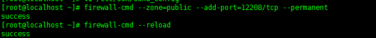

## Centos 7 优化

	在完成centos 7 的安装之后，我们还需要完成一些设置，以便能够更好使用它。

### 新增一个普通账户

这一步连同下一步，相当于为一个城市筑起两道城墙，既可加强防卫，也建立了一道警报机制，当敌人（黑客）卒然来袭，第一道城墙被袭击和破坏，我们还有第二道城墙阻延一下，有时间部署防卫甚至反击。所以这是一个很多人忽略，但其实非常重要的步骤。

首先新增一个账户：

> \# adduser shenchenbo

这个新帐号 ***'shenchenbo'*** 没有预设密码，即是说登入 ***'shenchenbo'*** 时系统不用输入密码！所以我们立即要设定密码：

 

> \# `passwd shenchenbo`

### 设置Root账户禁用SSH登入

CentOS 7 预设容许​​任何帐号透过ssh 登入，包括root 和一般帐号，为了不让root 帐号被黑客暴力入侵，我们必须禁止root 帐号的ssh 功能，事实上root 也没有必要ssh 登入伺服器，因为只要使用su 或sudo (当然需要输入root 的密码) 普通帐号便可以拥有root 的权限。使用vim (或任何文本编辑器) 开启/etc/ssh/sshd_config，寻找：

	＃PermitRootLogin yes

然后将其修改为：

	PermitRootLogin no

最后输入以下指令重新启动 sshd：

> \# `systemctl restart sshd`

这样黑客要取得root 的权限，必须破解root 和一个普通用户的密码，难度增加了。
完成后不要登出系统，使用另一个视窗尝试登入root 和普通帐号，测试无误便可进行下一步。

### 使用非常规SSH端口

SSH 预设使用端口22，这是在IANA 注册的官方端口，但没有人说ssh 不能使用其他端口，很多黑客专门向伺服器的22 端口发动攻击，即使你的伺服器固若金汤、牢不可破，但是要系统日以继夜接受攻击，消耗的系统资源（网络、处理器、记忆体等等）也不会少，何况它是否真的牢不可破还说不定呢！所以有必要让ssh 使用其他端口，只让有权使用ssh 的用户知道。

1. 修改端口

	使用vim (或任何文本编辑器) 开启/etc/ssh/sshd_config，寻找：

		# Port 22

	修改为：

		Port 12208
	
	你可以把10837 改为任何1024 – 65535 之间的任何数字。

	跟着重新启动 sshd：

	> \# `systemctl restart sshd`

	

2. 防火墙设置

	在Centos7中防火墙已经被替换成firewall，所以我们就使用其，添加端口SSH需要端口：

	> \# `firewall-cmd --zone=public --add-port=12208/tcp --permanent`

	> \# `firewall-cmd --reload`

	> \# zone 表示在哪个作用域： *public*表示公共，*default*表示默认

	> \# ***add*** 表示添加端口； ***delete*** 表示删除端口

	> \# ***permanent*** 表示永久有效

	> \# ***reload*** 重载防火墙设置

	

	由此同时，我们还需配置semanage，才能正常使其正常使用：

	-  安装semanage

		> \# yum provides /usr/sbin/semanage 

		> \# yum -y install policycoreutils-python 

	- 添加端口

		> \# semanage port -a -t ssh_ port _t -p tcp 12208
	
	至此，才算完成防火墙的设置。

	

3. 将源替换成阿里云及浙大

 - 备份原文件
		> \# mv /etc/yum.repos.d/CentOS-Base.repo /etc/yum.repos.d/CentOS-Base.repo.backup

 - 下载新源
		> \# wget -O /etc/yum.repos.d/CentOS-Base.repo http://mirrors.aliyun.com/repo/Centos-7.repo

 - 添加浙大源
		> \# rpm -Uvh http://mirrors.zju.edu.cn/epel/7/x86_64/e/epel-release-7-5.noarch.rpm

		
		
4. 设置每天自动更新

	一天都有成千上万的黑客在世界各地寻找Linux 系统和常见软件的安全漏洞，一有发现便会发动规模庞大而迅速的网络攻击，务求在我们来得及反应前把系统攻陷。不要以为黑客都只是十来岁的年轻小毛头，大部分黑客背后都有势力庞大、资源几乎无限的国家机构支持，有些甚至属于这些机构的雇员，美国的NSA，英国的GQHC，中国的无名黑客队伍，都是比较明目张胆由国家支持的网络黑帮，可见我们的系统时时刻刻都被凶狠之徒盯着，保持软件在最新的状态是其中一项我们必须做，也很容易做到的工作。

	首先我们立即手动更新所有预先安装的软件：

	> \# yum -y update
		
	跟着设定系统定时自动更新，第一步确定伺服器是否安装了自动执行指令的工具，跟着使用yum 一个名叫yum-cron 插件

	CentOS 7 使用数个软件来自动执行指令：cron、anacron、at 和batch，其中cron 和anacron 用来定期重复执行指令，At 和batch 则用来在特定时间执行一次性的指令。我们将会使用cron 和anacron，两者的分别这里不细表了，将来有机会再讨论，现在使用以下指令安装cron 和anacron：

	> \# yum -y install cronie
	
	下一步就是安裝 yum-cron：
		
	> \# yum -y install yum-cron

	其实你可以使用一个指令同时安装cronie 和yum-cron，甚至单独安装yum-cron 也可以，因为yum 会自动检测到yum-cron 需要cronie 然后自动替你安装，上面分开两个指令纯粹令大家容易明白。

	完成後系統多了數個檔案，比較重要的包括：

	- /etc/cron.daily/0yum.cron

		Anacron 每天执行这个档案一次，它根据配置档案/etc/yum/yum-cron.conf 来更新软件。

	- /etc/yum/yum-cron.conf

		这是每天执行yum-cron 的配置档案，预设只会下载更新的软件，并不安装，用意是让管理员检视yum-cron 的输出，选取需要更新的软件进行手动安装。

	跟着我们修改配置档案，让yum-cron 自动更新软件，使用vim (或任何文本编辑器) 开启/etc/yum/yum-cron.conf，寻找：

		apply_updates = no

	修改为：
	
		apply_updates = yes

	确认一下update_messages = yes, download_updates = yes, apply_updates = yes，正如下图：

	

	最后，启动 crond 和 yum-cron：

	> \# systemctl start crond
	
	> \# systemctl start yum-cron
